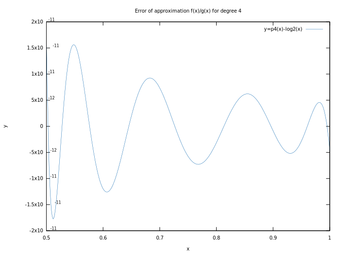
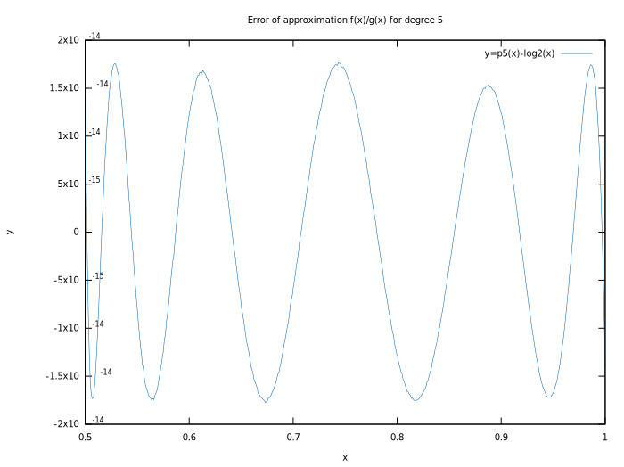

# How to use

Just look at the following code example on how to use the functions. I think it doesn't need more explaining than that.

```
#include <iostream>
#include "logapprox.h"

#define fastLN(x) fastLn(x, &fastLog2p6<double>)
#define fastLOG10(x) fastLog10(x, &fastLog2p6<double>)

// hello world example
int main() {
    double x = 2;
    // most accurate version
    double log2_y    = fastLog2p6<double>(x);  // log2(x)
    double log10_y   = fastLOG10(x);           // log10(x)
    double ln_y      = fastLN(x);              // ln(x)

    // print results
    std::cout << "log2(" << x << ")  = " << log2_y << std::endl;
    std::cout << "log10(" << x << ") = " << log10_y << std::endl;
    std::cout << "ln(" << x << ")    = " << ln_y << std::endl;

    return 0;
}
```

If you want to know what this can be used for, read on.

# Fast approximation of logarithm for double precision

This project is about an approach to logarithm approximation for <u>double precision</u> floating point values. Now you may have already found a lot such attempts, most claim to be much faster than this approach will be for you, but what most of those approaches have in common is their aim at single precision floating point values. So if for some reason single precision is not enough for you, read on.

## State of the art approaches

Basic idea of approximating CPU-efficient logarithms is always the following:

1. Extract mantissa **M** and exponent **E** of number **D**
2. split logarithm computation into
   1. compute log2(2^**E**) = **E**
   2. compute log2(**M**)
   3. log2(**D**) = **E** + approxLog2(**M**)
3. Multiply by 1/logB(2) to get the logarithm for an arbitrary base B

The difference between all approaches is then how point 1 and 2.2 are handled. You basically have to choose between:

- Proper error handling (like what to return if D is +-NaN, +-Inf or <= 0)
- Platform independence (especially regarding 1.)
- Accuracy
- Execution time

Accuracy and execution time are contradictory, hence we will need to compromise there.

## Motivation

Finding a real-world faster approximation to log2(**D**) needs a different type of function than a simple polynomial, because that is already what is currently done well enough by the standard libraries. I attempt to find out how far you can get regarding the trade-off between accuracy and execution time with platform independence and handling the special cases properly. Obviously aiming at double precision will only make sense if single precision is not enough, i. e.:

- absolute value does not fit into a float (i. e. the maximum representable exponent is too small)
- accuracy issues because the mantissa of float offers too few bits.

To remedy the accuracy issues it is obviously not a good idea to go for double precision and then accept an accuracy for the mantissa lower than single precision's 23 Bit. But it might still be useful if you have to handle absolute values that single precision cannot model.

## Goals

I accidentally stumbled upon this [paper](http://elib.mi.sanu.ac.rs/files/journals/tm/22/tm1212.pdf). In summary it shows that you can approximate logarithms using a fraction of two polynomials. The method that is used to derive the parameters of the polynomials leads to integer parameters, which I found unlikely to be optimal for such an approximation. So I attempted to find better possibly real-valued parameters that would generate a better approximation.

So basically you have to solve the following equation
$$\frac{a_nx^n + a_{n-1}x^{n-1} + ...+a_0}{b_nx^n + b_{n-1}x^{n-1}+...+b_0}\approx log_2(x)$$
for an arbitrary n. It is expected to get a higher accuracy with higher order polynomials, but you will also have more operations to compute, which will lead to a slower approximation. This is the aforementioned trade-off between speed and accuracy.

## Results

All experiments were run on a

- AMD Ryzen 5 2600
- Linux
- Compiler g++ 7.4.0 (-O3 -march=native).

It would be interesting to see the difference between various compilers and architectures, but I do not have the time to compile, run and analyze it all. The code contains a validation routine, which you can use to find out for yourself for your actual setting. Using -ffast-math will get you more speed at the cost of a little bit of accuracy for n=6. 

### Accuracy

Remember: single precision accuracy is approximately 1e-7 (23 bits) and double precision is roughly 2e-16 (52 bits).


This means that n=3 beats single precision accuracy and n=6 almost reaches double precision, which it could exceed if there were no numerical issues. But unfortunately using long double for approximation of double accuracy is not an option performance-wise.

The approximation accuracy increases exponentially with n. The numbers were determined using 1e12 uniformly distributed samples from the interval [1,2]. Remember: the graph has a logarithmic scale for y. Now follow the usual difference to real value plots.







From the discrete value areas in the last plot you can see that the limit of double precision is very close. You can see that with x close to 1, the values are quite accurate. The reason is: if you determine x^n with a value close to 1, then you will get a result close to 1. For 0.5 however, the value is 0.5^n, which is 2^-n. For simplicity let's assume the parameters would just all be 1. This would give you the equation (2^-6 + 2^-5 + 2^-4 + 2^-3 + 2^-2 + 2^-1 + 1) in both parts of the fraction. The problem with this is, that all these values have to be added to one another in the end and thus be represented by a single double precision number somewhere close to 2.0 (in this simplified equation). Regarding each individual part of that sum, the precision is quite high. But the precision of the sum is only the precision the sum can be represented with. So the smaller the part added to the sum is, the more of its originally available bits get cut off (I reduced the precision to 7 decimals for a simpler visualization).

```
x^0: 1.0yyyyyy
x^1: 0.50yyyyyZ
x^2: 0.250yyyyZZ
x^3: 0.1250yyyZZZ
x^4: 0.06250yyZZZZ
x^5: 0.031250yZZZZZ
x^6: 0.0156250ZZZZZZ
sum: 2.0yyyyyy
```

The information described by the Z positions is in large parts lost as part of the sum. This is only critical for values that actually need those bits in their representation, so 0.5 is a bad example in that regard, but values that cannot be represented within the precision of the sum, definitely have this issue. The closer x gets to 1, the more the situation improves because the values added to one another are similarly large and thus all have a similar precision. The same parameter combination used with long double values is actually more accurate than double precision (see below).


### Performance

The performance was measured computing 1e9 different logarithms in a loop for each of the algorithms. Baseline is the log2() function call for double precision of the gnu standard library. In addition the speedup was also measured on a raspberry pi 3 (arm).


Maximum speedup for x64 is <3.0 but comparable accuracy will only get you a speedup of <1.6. If you are willing to settle for a similar accuracy as single precision offers (n=3), then you can be at least twice as fast. The situation does not improve if you compile with -ffast-math, because standard library log2() also gets accelerated this way (by ignoring special cases). However all the fancy special cases like +-inf, NaN etc. will not be handled properly, which can be a pain to debug, so this is not recommended.

Interestingly the approximation for n=3 is faster (and more accurate) than single precision log() on the raspberry pi 3, but in general the speedup there is lower than on x64.

### Analysis

The speedup is not as big as I hoped for, but the main reasons for that is:

1. The existing log2 implementation in standard libraries is very well optimized already.
2. [frexp](https://en.cppreference.com/w/cpp/numeric/math/frexp), which is the only platform independent and standard compliant way of getting **E** and **M**, is responsible for the functions being so slow. You could do that one faster for specific platforms (and by ignoring special cases), but that was not the goal. It takes about 2/3 of the execution time for n=1. This gets a little better with bigger n (because the functions do more other computations), but so long as you use frexp, speedup is limited to 4.

Interestingly n=5 leads to a slower approximation than n=6. This was not further investigated, probably g++ could optimize the later better (you can use objdump -d to verify if you like).

### Code sample

Here an example for the simple case n=1. It is implemented as a template, so you can also use it for long double.

```
#include <boost/config.hpp>
#include <cmath>

template <class T>
inline T fastLog2p1(const T value) {
    // parameters that were optimized (see below on how)
    const T a = 1.4767235475800453;
    const T b = -1.477808113688585;
    const T c = 0.60987486544988612;
    const T d = 0.43559347328148307;

    if(BOOST_UNLIKELY(!std::isfinite(value))) {
    	// handle +-infinity input case
        return value == std::numeric_limits<T>::infinity() ? value : nan("1");
    } else if(BOOST_LIKELY(value > 0)) {
    	// handle most likely normal case
		// extract mantissa and exponent
        int iExp;
		T dM = frexp(value, &iExp);

		// compute approximation
		T x = 1.0/(c*dM + d);

        return iExp + x * (a*dM + b);
    } else {
    	// special cases of log
    	// infinity for x = 0 and undefined for x < 0
        return value == 0 ? -std::numeric_limits<T>::infinity() : -std::nan("1");
    }
}
```

## What did not work (well)

I tried linear and non-linear least squares methods first - only to realize, that what you really want to limit is not the least squares error (aka L2-norm) but the maximum error (aka L-inifinity-norm). Nonetheless I can recommend the following programs if you want to solve a (non-)linear least-squares problem:

1. [lmfit](https://jugit.fz-juelich.de/mlz/lmfit), which uses the Levenberg-Marquardt algorithm.

2. [ceres](http://ceres-solver.org), which is a much more powerful, flexible and easy to use solver.

3. [lapacke](https://www.netlib.org/lapack/lapacke.html), which you can use to solve linear equations.

## What finally got the job done (part 1)

Turns out it has been [known](https://apps.dtic.mil/dtic/tr/fulltext/u2/a080454.pdf) since the late 70's that you can formulate the problem of curve fitting for the L-infinity norm as a linear program and then have an LP-solver do the job for you.

Hence I used [lp_solve](http://lpsolve.sourceforge.net/5.5/) to compute the optimal parameters for $$n=1,2,3$$
I used the C-API of lp_solve to do the actual computations, but you can also find the generated linear program in the "lp" subfolder. For larger n, the solver would not produce a result, unless you would limit the search space to a very tight area of the search space, which could be guessed by the least-squares solutions. For that area, the solution could also be obtained. For higher order polynomials the linear programs would not provide a sufficient accuracy. This is a common problem with linear programs, since the solvers also have to make a trade-off between performance and accuracy and employ a lot of tricks to play one against the other but ultimately there is only so much they can do. I got a (poor) solution for n = 5, where lp_solve claimed very good numerical accuracy somewhere in the 1e-10 region, which was kind of disappointing given that n=4 already was already better than that.

## What finally got the job done (part 2)

Since the optimal approach had failed me for n > 4, I switched to desperate mode, which is where you try guessing solutions using semi-clever meta-heuristics. In this case I tried differential evolution, which I had experience with from the research I did for my diploma thesis.

For those kind of algorithms you need some good start solutions, so I ran ceres (see above) for a few million times and simply kept the best solutions as input for the differential evolution algorithm, which would then refine them regarding L-infinity norm as a primary objective and regarding L1-norm as a secondary objective. In this case it is helpful that the non-linear least-squares algorithms get stuck in different local optima, because that adds diversity to the input data. Since you can multiply the polynomial fraction with an arbitrary factor different from 0 without changing the result, you should normalize your input solutions to one of the parameters, for the optimization to work better. This way you eliminate an unnecessary degree of freedom and your solutions will improve much faster.

It should be noted that you need a few thousand sample values at least to get a decent fit. This is necessary to make sure you do not miss extreme values entirely. Another way I came up with was to optimize for the extreme values instead of a huge representative set of samples of the log2 function. This is much faster to compute, because you need to check much fewer values. The extreme value candidates can be computed numerically using the roots of the derivative of the function. The impatient can get that derivative from [WolframAlpha](https://www.wolframalpha.com) quite easily. Worked well for n = 5. But n = 6 was a real beast to wrestle with. Optimizing the values became increasingly hard, because the approximation accuracy attained is in the region of the accuracy of double precision floating point values itself. In that region, numerical issues suddenly become relevant and unfortunately that means, a very good solution for even higher precision might perform worse due to numerical issues that occur when you finally have to work with double precision values. Therefore using a lot of sample values proved more robust, because you can also optimize for those numerical issues. It is helpful regarding performance to first check accuracy on a lower number of samples initially and then validate this against the bigger set if it looks promising against the smaller set.

## Conclusions

- Even though the parameters are harder to optimize, fractions of two polynomials seem to be a promising alternative for logarithm function approximation (maybe for other function approximations as well).
- Speedup is moderate but there are different functions which can be chosen depending on the accuracy requirements.
- There is a lot more than just least-squares for all sorts of purposes.
- You can waste a lot of time trying to avoid numerical issues :-)
